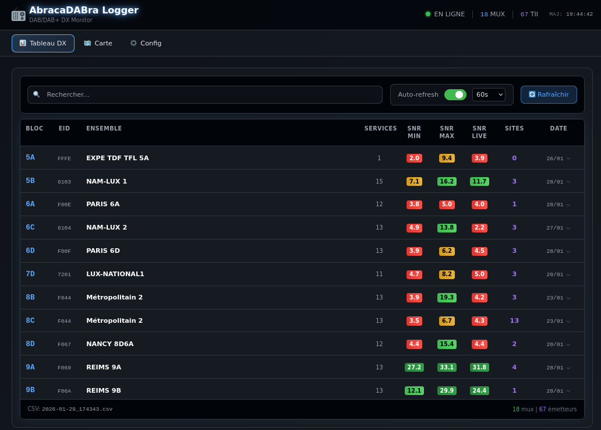
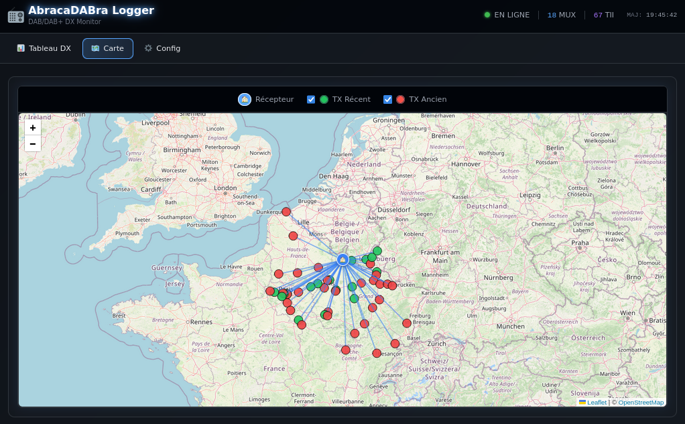
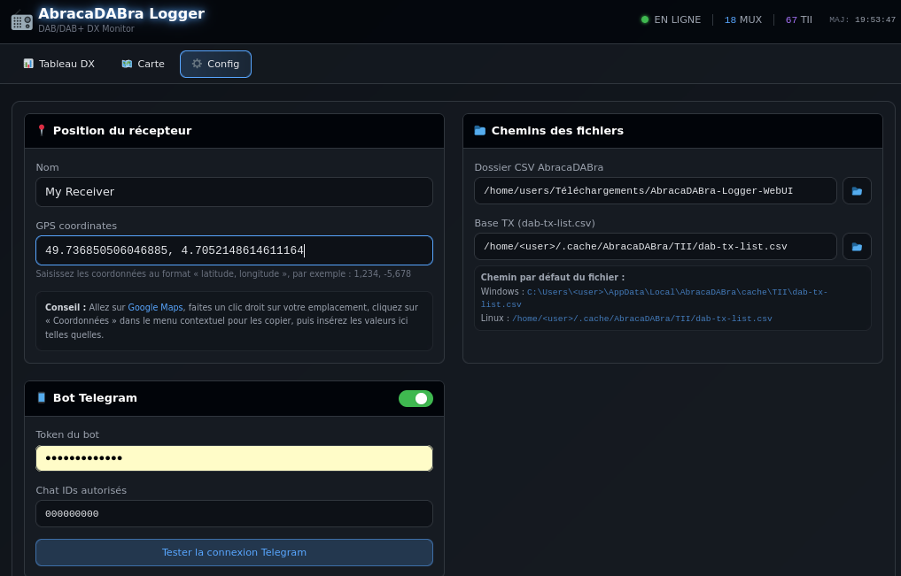
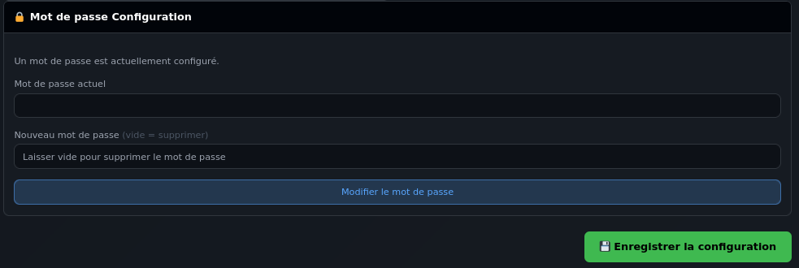

# AbracaDABra Logger WebUI

Interface web moderne pour visualiser et partager les logs de réception DAB/DAB+ d'**AbracaDABra**.


---

## Aperçu

### Tableau DX

Visualisez vos réceptions DAB/DAB+ dans un tableau interactif avec regroupement par mux et fréquence, code couleur SNR et recherche instantanée.



### Carte interactive

Localisez les émetteurs reçus sur une carte Leaflet avec le récepteur (marqueur bleu) et les émetteurs TX (marqueurs rouge/vert selon la distance).



### Configuration

Configurez l'ensemble de l'application depuis l'interface web : position du récepteur avec lien Google Maps, chemins des fichiers, bot Telegram avec test de connexion intégré.



### Protection par mot de passe

Protégez l'accès à la configuration par un mot de passe avec chiffrement SHA-256.



---

## Fonctionnalités

### Interface Web
- **Tableau DX** interactif avec regroupement par mux/fréquence
- **Dropdown TII** cliquable affichant les émetteurs (site, distance, SNR)
- **Carte Leaflet** avec marqueurs RX (bleu) et TX (rouge/vert)
- **Thème sombre** style FM-DX Webserver
- **Auto-refresh** configurable (15s à 60min)
- **Recherche** instantanée dans le tableau
- **Responsive** : compatible PC et smartphone

### Configuration
- **Position RX** avec coordonnées GPS et lien Google Maps
- **Chemins fichiers** avec indications des emplacements par défaut (Windows/Linux)
- **Bot Telegram** configurable avec test de connexion intégré
- **Mot de passe** optionnel pour protéger l'accès à la configuration
- **Navigateur de fichiers** intégré pour sélectionner les chemins

### Bot Telegram (intégré)
Commandes disponibles :
- `DX` — tous les mux
- `DX 9B` — filtrer par bloc
- `DX >300` — filtrer par distance
- `LAST` / `LAST 5` — réceptions les plus récentes
- `STATUS` — état du système
- `HELP` — aide

---

## Installation

### Prérequis
- Python 3.10+
- AbracaDABra avec export CSV activé

### Installation des dépendances

```bash
# Créer un environnement virtuel (recommandé)
python3 -m venv venv
source venv/bin/activate  # Linux/macOS
# ou: venv\Scripts\activate  # Windows

# Installer les dépendances
pip install -r requirements.txt
```

---

## Lancement

```bash
# Activer l'environnement virtuel
source venv/bin/activate

# Lancer le serveur
python run.py
```

Puis ouvrir http://localhost:8000 dans votre navigateur.

### Options de lancement

```bash
python run.py --host 0.0.0.0 --port 8000        # Accessible sur le réseau local
python run.py --reload                           # Mode développement (auto-reload)
```

---

## Configuration

### Via l'interface web

1. Ouvrir http://localhost:8000
2. Cliquer sur l'onglet **Config**
3. Configurer :
   - **Position RX** : nom et coordonnées GPS du récepteur (avec lien Google Maps)
   - **Chemins** : dossier CSV AbracaDABra et base TX TII
   - **Telegram** : token du bot, chat IDs autorisés, test de connexion
   - **Mot de passe** : protéger l'accès à la configuration (optionnel)

### Emplacement de la base TX (dab-tx-list.csv)

| OS | Chemin par défaut |
|----|-------------------|
| Windows | `C:\Users\<user>\AppData\Local\AbracaDABra\cache\TII\dab-tx-list.csv` |
| Linux | `/home/<user>/.cache/AbracaDABra/TII/dab-tx-list.csv` |

### Via fichier JSON

Le fichier `data/config.json` est créé automatiquement au premier lancement :

```json
{
  "paths": {
    "csv_dir": "/chemin/vers/dossier/csv",
    "tx_db_path": "/chemin/vers/dab-tx-list.csv",
    "out_dir": "/chemin/vers/export"
  },
  "rx": {
    "name": "Mon Récepteur",
    "lat": 49.768,
    "lon": 4.72
  },
  "telegram": {
    "token": "123456:ABC...",
    "enabled": true
  }
}
```

> **Note** : Le fichier `data/config.json` contient des données sensibles (token Telegram). Il est exclu du dépôt Git via `.gitignore`.

### Mot de passe oublié

Si vous oubliez votre mot de passe de configuration, éditez le fichier `data/config.json` et supprimez la valeur de `config_password_hash` :

```json
"config_password_hash": ""
```

### Via variables d'environnement (legacy)

```bash
export ABRACA_CSV_DIR="/home/user/Documents"
export ABRACA_TG_TOKEN="123456:ABC..."
```

---

## Structure du projet

```
AbracaDABra-Logger-WebUI/
├── app/
│   ├── api/
│   │   ├── models/         # Modèles Pydantic
│   │   └── routes/         # Endpoints API REST
│   ├── core/
│   │   ├── csv_parser.py   # Parsing CSV AbracaDABra
│   │   ├── tx_database.py  # Base TX TII
│   │   ├── matcher.py      # Matching RX/TX
│   │   └── telegram_bot.py # Bot Telegram
│   ├── static/             # JS, CSS
│   ├── templates/          # HTML (Jinja2)
│   ├── config.py           # Gestion configuration
│   └── main.py             # Application FastAPI
├── data/
│   └── config.json         # Configuration utilisateur (non versionné)
├── picture/                # Captures d'écran
├── requirements.txt
├── run.py                  # Point d'entrée
└── README.md
```

---

## API REST

| Endpoint | Méthode | Description |
|----------|---------|-------------|
| `/api/status` | GET | État du système |
| `/api/dx/table` | GET | Données du tableau DX |
| `/api/map/markers` | GET | Marqueurs pour la carte |
| `/api/config` | GET | Configuration actuelle |
| `/api/config` | PUT | Mettre à jour la configuration |
| `/api/config/password-status` | GET | Vérifier si un mot de passe est configuré |
| `/api/config/verify-password` | POST | Vérifier le mot de passe |
| `/api/config/set-password` | POST | Définir/modifier le mot de passe |
| `/api/config/browse` | GET | Navigateur de fichiers |
| `/api/telegram/status` | GET | État du bot Telegram |
| `/api/telegram/start` | POST | Démarrer le bot |
| `/api/telegram/stop` | POST | Arrêter le bot |
| `/api/telegram/test` | POST | Tester la connexion Telegram |

---

## Dépendances

- **FastAPI** — Framework web async
- **Uvicorn** — Serveur ASGI
- **Pandas** — Traitement des données CSV
- **Pydantic** — Validation des données
- **Requests** — API Telegram
- **Jinja2** — Templates HTML

Frontend (CDN) :
- **Tailwind CSS** — Styling
- **Alpine.js** — Interactivité
- **Leaflet.js** — Carte interactive

---

## Licence

MIT — Voir [LICENSE](LICENSE)
